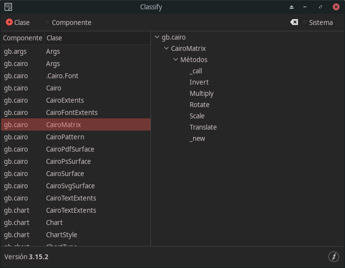
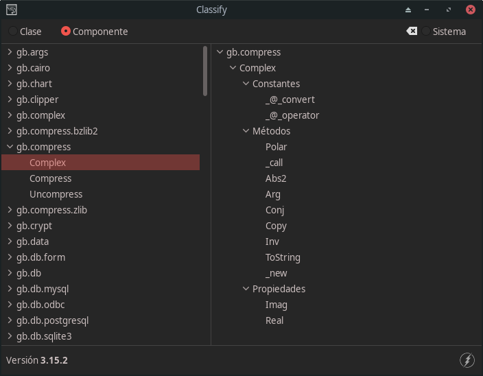
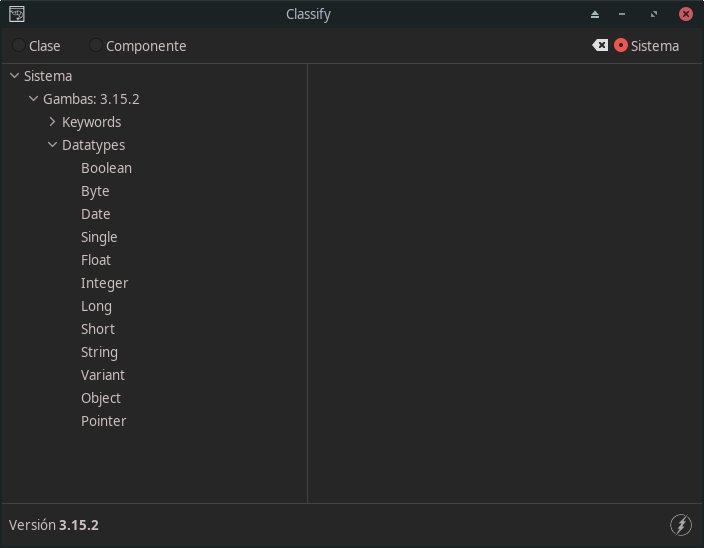

# classify
Class Explorer for Gambas

## Screen shots

## Features
Lists all the classes of the shrimp version installed on the system. It presents the data in two ways.
 - Grouping by components in tree view
 - List of two columns, one with the component and one with the class.
It does not use the internet to retrieve information from a remote site, and all data is extracted from the system from a local directory.
Then it also lists the shrimp reserved words and data types in a tree view.

## References
This program has been developed with Gambas IDE.
